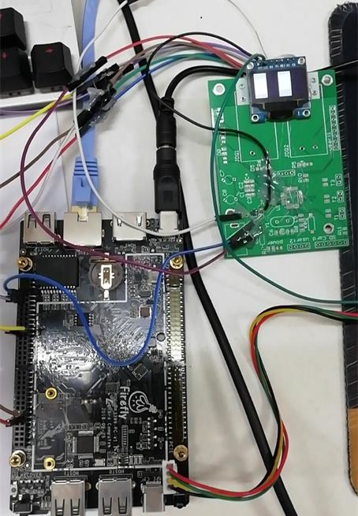

## board : ROC-RK3399-PC  ##

### 1 led 驱动 ###

**2019-09-06 add led driver 01**                

### 2 按键驱动 ###

**2019-09-10 add key driver 02**     
 
- 支持阻塞IO模型，等待队列

**2019-09-12 add key driver 03**     

- 支持多路IO复用模型，poll机制

**2019-09-12 add key driver 04**     

- 支持异步通知IO模型

**2019-09-12 add key driver 05**     

- 支持并发控制之原子操作

**2019-09-12 add key driver 06**     

- 支持并发控制之信号量

**2019-09-12 add key driver 07**     

- 支持阻塞与非阻塞访问

**2019-09-12 add key driver 08**     

- 支持定时器按键消抖

**2019-09-15 add spi oled driver(01) 09**     

- spi驱动-oled驱动 ok    

### author : hui zhang ###
### hexo : tjpuzhanghui.github.io ###

